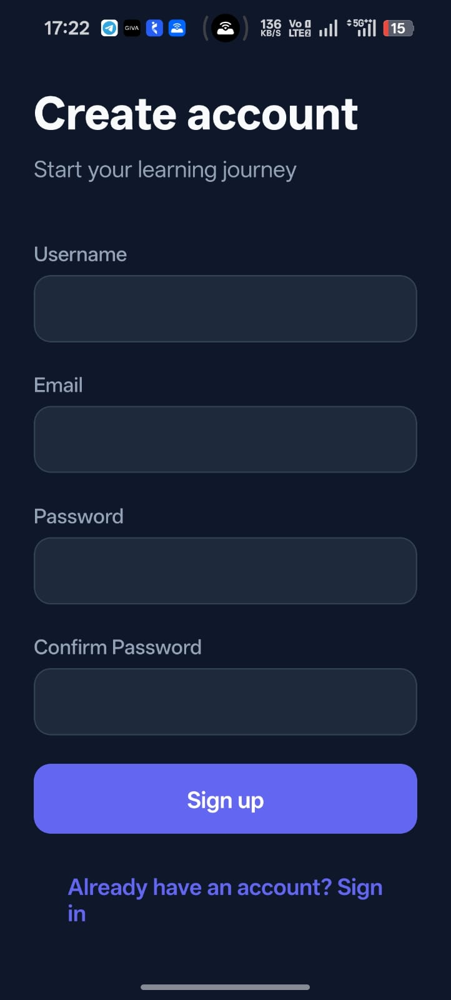
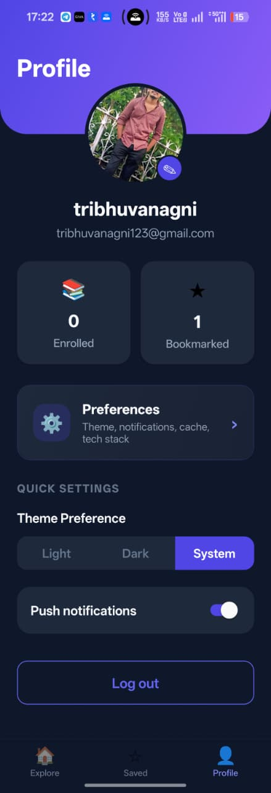

# Mini LMS (Expo)

A small course-discovery app: sign in, browse a catalog, bookmark things, open a course detail page, and optionally read content in an embedded webview. We leaned on Expo so one codebase covers Android and iOS without maintaining two native projects.

## Project overview and screenshots

The home screen is a searchable catalog. Course pages show metadata, enroll/save actions, and AI-suggested “similar” picks at the bottom. Bookmarks and enrolled state persist on the device. If the network drops, you still see the last cached catalog (with a banner so it’s obvious you’re offline).

**Screenshots**

We don’t ship large PNGs in git by default. Drop a few exports here so teammates and reviewers can skim the UI without installing:

`docs/screenshots/`

Suggested set (rename however you like):

## Screenshots

### Loading
.jpeg)

### Register


### Sign In


### Home


### Course


### Bookmark


### Profile


---

## Setup

**Requirements:** Node 20+ (matches our CI), npm, and for device testing either Expo Go or a dev build.

```bash
git clone <your-fork-or-repo-url>
cd mini-lms
npm install
# If npm complains about peers (some Expo stacks do), try:
# npm install --legacy-peer-deps
```

Copy env template and fill in what you need:

```bash
cp .env.example .env
```

Start Metro:

```bash
npx expo start
```

From there: press `a` for Android emulator, `i` for iOS simulator, or scan the QR code with Expo Go. Web is available with `w` if you want a quick smoke test (not the primary target).

---

## Environment variables

Values prefixed with `EXPO_PUBLIC_` are inlined at bundle time. Don’t put secrets you wouldn’t paste into a client binary.

| Variable | Required? | Purpose |
|----------|-----------|---------|
| `EXPO_PUBLIC_API_BASE_URL` | Has default | Base URL for the REST client (defaults to `https://api.freeapi.app`). |
| `EXPO_PUBLIC_GEMINI_API_KEY` | Optional | Powers home + detail AI recommendations. Empty key = UI falls back gracefully. |
| `EXPO_PUBLIC_SENTRY_DSN` | Optional | Reserved for real Sentry wiring; the app currently uses a small stub around crash reporting. |

See **`.env.example`** in the repo root for a ready-to-copy template.

**EAS builds:** If you use Expo Application Services, set the same variables in the EAS dashboard (or secrets) for the profile you build with. Our `eas.json` preview profile still references `EXPO_PUBLIC_API_URL` in one place while the app reads `EXPO_PUBLIC_API_BASE_URL` — keep both aligned or update `eas.json` to match so cloud builds don’t surprise you.

---

## Architecture (why we did it this way)

**Expo Router + file-based routes** — Less boilerplate than hand-rolled stacks, and the folder structure doubles as documentation for where screens live.

**Zustand for state** — Auth, courses, preferences, and recommendation cache are separate stores. We wanted something easier to read than Redux for a repo this size, with hydration from AsyncStorage where it matters.

**AsyncStorage-backed catalog cache** — Courses are fetched from a public demo API, then cached locally so the app isn’t a brick on the train. Tokens go through **Expo SecureStore** instead of living in plain JSON.

**Axios + interceptors** — One client, shared auth header, 401 refresh attempt, and breadcrumbs hooked into our logging layer.

**React Hook Form + Zod on auth screens** — Validated forms before we hit the network; error messages stay on the fields where users expect them.

**FlashList on the home feed** — Big lists with images get choppy fast on older phones. FlashList was the pragmatic choice over FlatList here.

**Gemini for recommendations** — The brief mentioned OpenAI; we shipped **Google Generative AI** instead because keys and quotas were simpler for a demo. Prompts are grounded on the live course catalog so titles map back to real rows.

**Notifications behind an Expo Go guard** — `expo-notifications` is picky in Expo Go on newer SDKs, so milestone and reminder code paths no-op there and run in dev/production builds.

**“Analytics” without a third-party SDK** — Screen views and events append to AsyncStorage with a cap. Useful for demos and privacy-conscious reviewers; it’s not Amplitude or Firebase.

---

## Known issues and limitations

The ones that matter most when you run, ship, or extend the app:

- **Expo Go:** Local notifications (bookmark milestones, inactivity reminder) are not representative in Expo Go. Use a **development** or **preview** build to test them properly.
- **Backend & offline:** The catalog comes from a **public demo API** and is **cached on device**. Offline = last good snapshot + banner; **bookmarks / enrollments are not synced** to a backend when you reconnect.
- **Auth reset behavior (handled):** The demo backend can reset and return `Account not found` for previously created users. To prevent lockouts, the app now keeps a local account/session fallback and allows login from local data when remote auth records disappear.
- **AI:** Recommendations need **`EXPO_PUBLIC_GEMINI_API_KEY`** and a working Gemini API; model or quota issues show up as **empty** home/detail suggestion blocks. The rest of the app still runs.
- **EAS / env:** The app reads **`EXPO_PUBLIC_API_BASE_URL`**; `eas.json` preview still mentions **`EXPO_PUBLIC_API_URL`**. Set **`EXPO_PUBLIC_API_BASE_URL`** (and Gemini, if needed) in EAS secrets so cloud builds don’t silently point at the wrong host.
- **Sentry:** `@sentry/react-native` is in the project, but **`src/services/sentry.ts` is still a stub**—wire real `Sentry.init` + DSN there when you want production crash reporting.

---

## Tests

```bash
npm test
```

Uses Jest with the `jest-expo` preset. `--passWithNoTests` is handy in CI if a branch only touches docs.

Typecheck only (what we call `lint` in `package.json`):

```bash
npm run lint
# → npx tsc --noEmit
```

---

## Building an APK

You’ll need an [Expo](https://expo.dev) account and the EAS CLI.

```bash
npm install -g eas-cli
eas login
```

Link the project if you haven’t:

```bash
eas project:init
```

**Preview APK** (installable `.apk`, good for sharing):

```bash
eas build -p android --profile preview --non-interactive
```

Builds run on Expo’s servers; grab the artifact link from the dashboard or the CLI output. On the phone you may need to allow installs from unknown sources.

**AI in the APK:** `EXPO_PUBLIC_*` values are fixed at **build** time. A phone install has no `.env` file—add **`EXPO_PUBLIC_GEMINI_API_KEY`** (and `EXPO_PUBLIC_API_BASE_URL` if needed) under your project’s **EAS Secrets** / environment for the profile you build with, then run a **new** build. Otherwise AI sections stay empty but use normal user-facing copy.

**Development client** (if you want native modules + dev menu without Expo Go):

```bash
eas build -p android --profile development
npx expo start --dev-client
```

**Play Store–style release** in this repo targets an **Android App Bundle** (`production` profile in `eas.json`), not an APK.

---

## Try the app (for reviewers)

**Live deployment link (Expo Update preview):**  
[Open live preview in Expo Go](https://expo.dev/preview/update?message=Option+2%3A+preview+channel+publish&updateRuntimeVersion=1.0.0&createdAt=2026-05-03T12%3A23%3A22.579Z&slug=exp&projectId=83211a7f-9de3-440f-818e-047b83333a37&group=8c31b1ba-5216-4ff5-97e5-141867b2303f)

### How reviewers run it

1. Install **Expo Go**: [https://expo.dev/go](https://expo.dev/go)
2. Open the deployment link above on mobile.
3. It redirects to Expo Go and loads the project update.

If the link opens a login page on desktop, open the same link on a phone with Expo Go installed.

---

## Technologies

### Frontend (this repo — mobile app)

| Area | What we use |
|------|----------------|
| **Runtime** | React 19, React Native 0.81, **Expo SDK 54** |
| **Navigation** | **Expo Router** (file-based routes) |
| **Language** | **TypeScript** |
| **Styling** | **NativeWind** (Tailwind-style classes on RN primitives) |
| **Global state** | **Zustand** (auth, courses, preferences, recommendation cache) |
| **Forms & validation** | **React Hook Form**, **Zod**, **@hookform/resolvers** |
| **Lists** | **@shopify/flash-list** (home catalog) |
| **Images** | **expo-image** |
| **Motion** | **react-native-reanimated** (in the toolchain); several screens also use React Native’s built-in `Animated` API |
| **Gestures & shell** | react-native-gesture-handler, react-native-screens, react-native-safe-area-context |
| **Embedded content** | **react-native-webview** (+ small JS bridge for the course HTML template) |
| **HTTP** | **Axios** (shared client, auth + refresh interceptors) |
| **AI (client-side calls)** | **@google/generative-ai** (Gemini) for recommendations |
| **Notifications** | **expo-notifications** |
| **Connectivity** | **@react-native-community/netinfo** (offline banner / behavior) |
| **Other Expo modules** | expo-secure-store, expo-haptics, expo-linear-gradient, expo-image-picker, expo-constants, expo-updates, etc. |

Web is supported in principle via Expo (`react-native-web`), but day-to-day development targets **Android and iOS**.

### Backend (remote services — not shipped inside this repo)

There is **no custom Node/Express (etc.) server in this repository**. The app talks to:

| Role | Technology / host |
|------|---------------------|
| **REST API** | **FreeAPI** — `https://api.freeapi.app` by default (`EXPO_PUBLIC_API_BASE_URL`). Used for auth, user/profile-style data, and product listings that we **map into course objects** in the app. |
| **Recommendations** | **Google Gemini** (HTTPS API) when `EXPO_PUBLIC_GEMINI_API_KEY` is set. |

Swap the base URL or add your own BFF later; the client is just Axios + env.

### Database & on-device storage

There is **no Postgres/SQLite/Mongo instance** bundled with the app. Persistence is **client-side only**:

| Layer | Technology |
|-------|------------|
| **Structured cache & prefs** | **@react-native-async-storage/async-storage** (JSON via a small `storage` helper — courses snapshot, bookmark IDs, prefs, local analytics queue, AI response cache metadata, etc.) |
| **Secrets / tokens** | **expo-secure-store** (access + refresh tokens) |
| **Fast native KV (optional)** | **react-native-mmkv** is in `package.json` for projects that want synchronous storage; the main typed wrapper today is AsyncStorage. |

So: **frontend** = Expo/React Native app above; **backend** = external REST + optional Gemini; **“database”** = AsyncStorage + SecureStore on the device, not a server DB.

---

## Bonus / stretch items that actually landed

- Typed auth forms (**React Hook Form + Zod**).
- **Expo Notifications**: bookmark milestone nudge (every 5th save) and a 24h inactivity reminder (not in Expo Go).
- **expo-image** on cards and key art (disk + memory caching).
- **react-native-webview** with a small bridge for the course HTML template.
- **FlashList** for the catalog.
- **react-native-reanimated** is installed (Babel plugin too); list card motion mostly uses the built-in `Animated` API for now.
- Local **analytics** service (no outbound telemetry by default).
- **Jest** + **React Native Testing Library** with a starter test around `CourseCard`.
- **AI recommendations** (Gemini) on home and course detail, with bookmark categories feeding interests.
- **GitHub Actions** workflow: install, TypeScript check, tests; optional EAS APK on `main` when `EXPO_TOKEN` is configured.
- Dark / light / system theme via preferences (palette updates as soon as you change the setting).

---

## Everything else

- **API:** Course data and auth come from the **FreeAPI** demo host unless you point `EXPO_PUBLIC_API_BASE_URL` elsewhere.
- **Offline banner:** Implemented in the root layout; NetInfo drives it.
- **Odds and ends:** There are occasional scratch scripts in the repo root (`debug-models`, etc.) — safe to ignore for running the app; they’re not part of the production bundle.

If something in this README drifts from the code, trust the source — and please open a PR to fix the doc.
